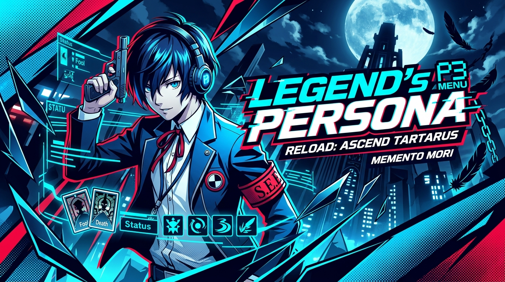

<div align="center">

# 🎭 LEGEND'S PERSONA — PORTFOLIO

<p align="center">
  
</p>

[](https://persona-portfolio-ashy.vercel.app)
[](https://persona-legend.vercel.app)
[](https://reactjs.org/)
[](https://vitejs.dev/)

<br/>

> **"Memento Mori — Remember you must die. Make your mark before the Dark Hour strikes."**

<p align="center">
  A high-octane, interactive web portfolio heavily inspired by the stylish UI/UX aesthetic of <b>Persona 3 Reload</b>. Built with seamless video loops, kinetic typography, dynamic character cards, and hardware-accelerated animations.
</p>

---

[🎮 **Explore Live Portfolio**](https://persona-portfolio-ashy.vercel.app) • [✨ **Mirror Link**](https://persona-legend.vercel.app) • [👤 **GitHub Profile**](https://github.com/Legend-1s-here)

---

</div>

<br/>

## 🌌 Key Features

- **🎮 Persona 3 Reload Diagonal UI Menu**: Custom skew-transformed menu with kinetic hover animations, sound FX styling, and keyboard navigation.
- **⚡ Hardware-Accelerated Video Backgrounds**: Optimized H.264 video streams with instant `+faststart` streaming and WebP poster fallbacks for zero delay.
- **📊 Interactive Character & Bio Stats**: S.E.E.S.-style character cards with animated stat bars, dynamic roles, and reveal panels.
- **📄 Interactive Resume & Project Showcase**: Stylish Persona-themed dossier views highlighting full-stack engineering skills.
- **⌨️ Full Keyboard & Gamepad-Style Navigation**: Navigate with `↑` / `↓` Arrow keys and `Enter` or mouse interactions.
- **📱 Fully Responsive**: Dynamic layouts tailored for desktop and mobile screens.

<br/>

## 🕹️ Controls & Navigation

| Input | Action |
| :--- | :--- |
| **`Arrow Up (↑)`** | Move cursor up |
| **`Arrow Down (↓)`** | Move cursor down |
| **`Enter (↵)`** | Select / Open Section |
| **`Mouse Hover`** | Focus item & trigger sound visualizer |
| **`Mouse Click`** | Navigate to selected page / external link |

<br/>

## 🛠️ Tech Stack

- **Frontend Core**: [React](https://reactjs.org/), [Vite](https://vitejs.dev/)
- **Animations & Routing**: [Framer Motion](https://www.framer.com/motion/), [React Router](https://reactrouter.com/)
- **Styling**: CSS3 Custom Skew & Clip-Path Polygons, Hardware Compositing (`transform: translateZ(0)`)
- **Media Engine**: Custom compressed H.264 video streams with WebP posters
- **Deployment**: [Vercel](https://vercel.com/) Edge Network

<br/>

## 🚀 Getting Started

### Prerequisites
- [Node.js](https://nodejs.org/) (v18 or higher recommended)
- [npm](https://www.npmjs.com/) or [yarn](https://yarnpkg.com/)

### Installation

1. **Clone the repository:**
   ```bash
   git clone https://github.com/Legend-1s-here/Persona_Portfolio.git
   cd Persona_Portfolio
   ```

2. **Install dependencies:**
   ```bash
   npm install
   ```

3. **Start the local development server:**
   ```bash
   npm run dev
   ```
   Open [http://localhost:5173](http://localhost:5173) in your browser.

4. **Build for production:**
   ```bash
   npm run build
   ```

<br/>

## 👤 Author

**Priyansh (Legend)**
- 🌐 Portfolio: [persona-portfolio-ashy.vercel.app](https://persona-portfolio-ashy.vercel.app)
- 🐙 GitHub: [@Legend-1s-here](https://github.com/Legend-1s-here)

<br/>

<div align="center">

---

*Persona 3 Reload UI/UX concept inspired by ATLUS. Customized by **Legend**.*

</div>
